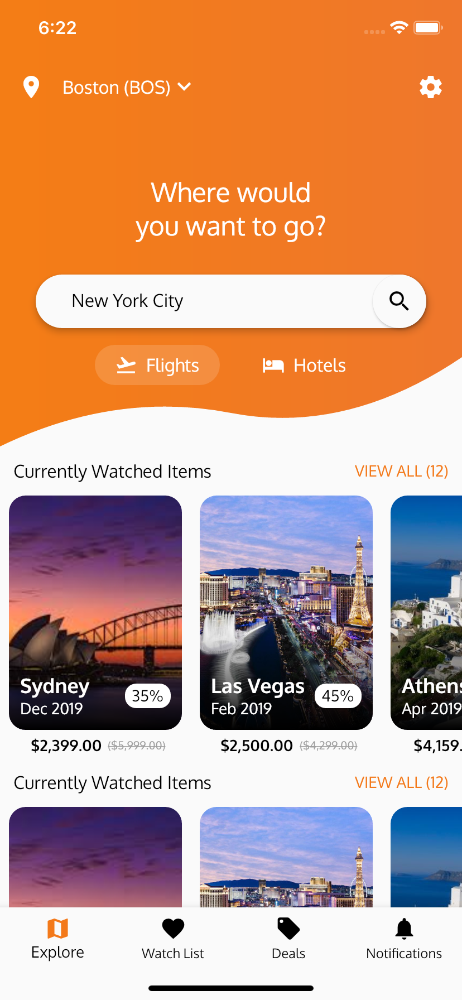

# Flight Finder

Used the Flutter SDK along with Firebase/Firestore to create an IOS app that
pulls data from a database and displays them in a clean and interactive user
interface.

## Screenshots

  
  

## Future Plans

This app currently pulls dummy flight information from a database I created on Firestore. I plan to connect this to SkyScanners API to pull real flight information as needed!

